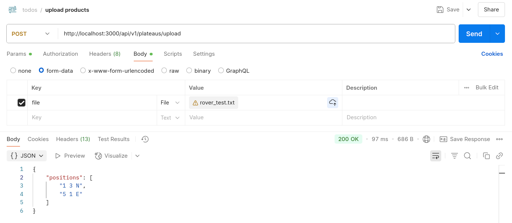

# README

# 🚀 Rover Command API

API for executing rover movement commands within a defined plateau.
Rovers are positioned on a grid-based plateau and follow movement instructions that rotate or advance them based on direction.

## 🧭 Overview

Each rover starts at a specified position on the plateau, facing one of the four cardinal directions:

- `N` – North
- `E` – East
- `S` – South
- `W` – West

### Movement Rules

Commands are sent as a string of characters, with the following rules:

- `L` – Rotate the rover 90° to the **left**
- `R` – Rotate the rover 90° to the **right**
- `M` – Move **forward** one grid unit in the current direction

You can control rovers via API endpoints or by uploading a `.txt` file containing multiple command sequences.

---

## 📦 API Endpoints

```bash
➕ Create a Plateau

curl -X POST http://localhost:3000/api/v1/plateaus \
     -H "Content-Type: application/json" \
     -d '{"width":5, "height":5}'

🤖 Create a Rover with Initial Position and Direction

curl -X POST http://localhost:3000/api/v1/plateaus/2/rovers \
     -H "Content-Type: application/json" \
     -d '{"pos_x":3, "pos_y":3, "direction":"E"}'

🛰️ Send Commands to a Rover

curl -X POST http://localhost:3000/api/v1/plateaus/2/rovers/2/commands \
     -H "Content-Type: application/json" \
     -d '{"commands":"MMRMMRMRRM"}'

📄 Upload a Commands File

curl -X POST http://localhost:3000/api/v1/plateaus/upload \
     -F "file=@<:path>/rover_test.txt"



📚 Swagger API Documentation

Access the interactive API docs at:

http://localhost:3000/api-docs/index.html

🛠 How to Run the Project
🧱 With Rails Installed

bundle install
rails db:prepare
rails s

🐳 Using Docker (No Rails Needed Locally)

# Build the Docker image
docker build -t foxbit-rover .

# Run the container
docker run --name rover -p 3000:3000 foxbit-rover

# (Optional) Start or stop the container
docker start rover
docker stop rover

✅ Running Tests

docker exec -it rover bundle exec rspec

📝 License

MIT